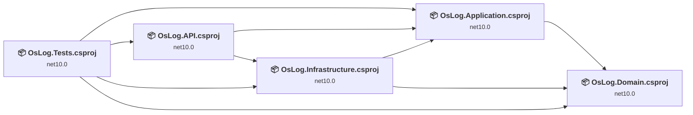
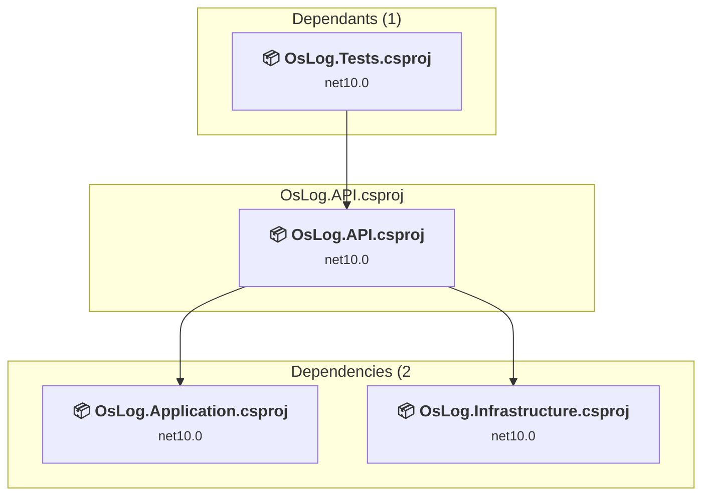
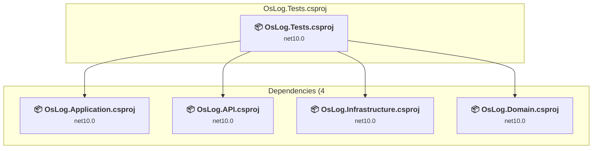
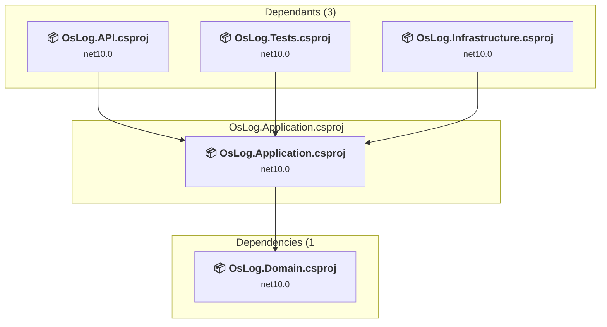
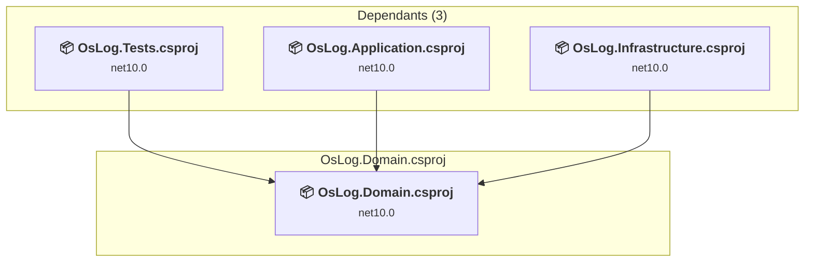
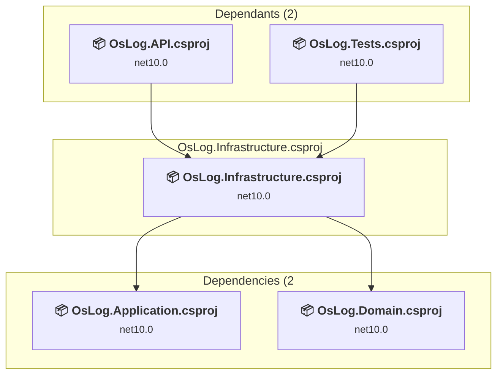

# Projects and dependencies analysis

This document provides a comprehensive overview of the projects and their dependencies in the context of upgrading to .NETCoreApp,Version=v10.0.

## Table of Contents

- [Executive Summary](#executive-Summary)
  - [Highlevel Metrics](#highlevel-metrics)
  - [Projects Compatibility](#projects-compatibility)
  - [Package Compatibility](#package-compatibility)
  - [API Compatibility](#api-compatibility)
- [Aggregate NuGet packages details](#aggregate-nuget-packages-details)
- [Top API Migration Challenges](#top-api-migration-challenges)
  - [Technologies and Features](#technologies-and-features)
  - [Most Frequent API Issues](#most-frequent-api-issues)
- [Projects Relationship Graph](#projects-relationship-graph)
- [Project Details](#project-details)

  - [OsLog.API\OsLog.API.csproj](#oslogapioslogapicsproj)
  - [OsLog.Application.Tests\OsLog.Tests.csproj](#oslogapplicationtestsoslogtestscsproj)
  - [OsLog.Application\OsLog.Application.csproj](#oslogapplicationoslogapplicationcsproj)
  - [OsLog.Domain\OsLog.Domain.csproj](#oslogdomainoslogdomaincsproj)
  - [OsLog.Infrastructure\OsLog.Infrastructure.csproj](#osloginfrastructureosloginfrastructurecsproj)

## Executive Summary

### Highlevel Metrics

| Metric | Count | Status |
| :--- | :---: | :--- |
| Total Projects | 5 | 0 require upgrade |
| Total NuGet Packages | 24 | All compatible |
| Total Code Files | 110 |  |
| Total Code Files with Incidents | 0 |  |
| Total Lines of Code | 7641 |  |
| Total Number of Issues | 0 |  |
| Estimated LOC to modify | 0+ | at least 0,0% of codebase |

### Projects Compatibility

| Project | Target Framework | Difficulty | Package Issues | API Issues | Est. LOC Impact | Description |
| :--- | :---: | :---: | :---: | :---: | :---: | :--- |
| [OsLog.API\OsLog.API.csproj](#oslogapioslogapicsproj) | net10.0 | ✅ None | 0 | 0 |  | AspNetCore, Sdk Style = True |
| [OsLog.Application.Tests\OsLog.Tests.csproj](#oslogapplicationtestsoslogtestscsproj) | net10.0 | ✅ None | 0 | 0 |  | ClassLibrary, Sdk Style = True |
| [OsLog.Application\OsLog.Application.csproj](#oslogapplicationoslogapplicationcsproj) | net10.0 | ✅ None | 0 | 0 |  | ClassLibrary, Sdk Style = True |
| [OsLog.Domain\OsLog.Domain.csproj](#oslogdomainoslogdomaincsproj) | net10.0 | ✅ None | 0 | 0 |  | ClassLibrary, Sdk Style = True |
| [OsLog.Infrastructure\OsLog.Infrastructure.csproj](#osloginfrastructureosloginfrastructurecsproj) | net10.0 | ✅ None | 0 | 0 |  | ClassLibrary, Sdk Style = True |

### Package Compatibility

| Status | Count | Percentage |
| :--- | :---: | :---: |
| ✅ Compatible | 24 | 100,0% |
| ⚠️ Incompatible | 0 | 0,0% |
| 🔄 Upgrade Recommended | 0 | 0,0% |
| ***Total NuGet Packages*** | ***24*** | ***100%*** |

### API Compatibility

| Category | Count | Impact |
| :--- | :---: | :--- |
| 🔴 Binary Incompatible | 0 | High - Require code changes |
| 🟡 Source Incompatible | 0 | Medium - Needs re-compilation and potential conflicting API error fixing |
| 🔵 Behavioral change | 0 | Low - Behavioral changes that may require testing at runtime |
| ✅ Compatible | 0 |  |
| ***Total APIs Analyzed*** | ***0*** |  |

## Aggregate NuGet packages details

| Package | Current Version | Suggested Version | Projects | Description |
| :--- | :---: | :---: | :--- | :--- |
| AutoMapper | 16.0.0 |  | [OsLog.API.csproj](#oslogapioslogapicsproj) [OsLog.Application.csproj](#oslogapplicationoslogapplicationcsproj) [OsLog.Tests.csproj](#oslogapplicationtestsoslogtestscsproj) | ✅Compatible |
| coverlet.collector | 6.0.4 |  | [OsLog.Tests.csproj](#oslogapplicationtestsoslogtestscsproj) | ✅Compatible |
| Microsoft.AspNetCore.Http.Abstractions | 2.3.0 |  | [OsLog.Application.csproj](#oslogapplicationoslogapplicationcsproj) | ✅Compatible |
| Microsoft.AspNetCore.Identity.EntityFrameworkCore | 10.0.1 |  | [OsLog.Infrastructure.csproj](#osloginfrastructureosloginfrastructurecsproj) | ✅Compatible |
| Microsoft.AspNetCore.Mvc.Testing | 10.0.1 |  | [OsLog.Tests.csproj](#oslogapplicationtestsoslogtestscsproj) | ✅Compatible |
| Microsoft.EntityFrameworkCore | 10.0.1 |  | [OsLog.API.csproj](#oslogapioslogapicsproj) [OsLog.Infrastructure.csproj](#osloginfrastructureosloginfrastructurecsproj) | ✅Compatible |
| Microsoft.EntityFrameworkCore.Design | 10.0.1 |  | [OsLog.API.csproj](#oslogapioslogapicsproj) [OsLog.Infrastructure.csproj](#osloginfrastructureosloginfrastructurecsproj) | ✅Compatible |
| Microsoft.EntityFrameworkCore.InMemory | 10.0.1 |  | [OsLog.API.csproj](#oslogapioslogapicsproj) | ✅Compatible |
| Microsoft.EntityFrameworkCore.Sqlite | 10.0.1 |  | [OsLog.Tests.csproj](#oslogapplicationtestsoslogtestscsproj) | ✅Compatible |
| Microsoft.EntityFrameworkCore.SqlServer | 10.0.1 |  | [OsLog.Infrastructure.csproj](#osloginfrastructureosloginfrastructurecsproj) | ✅Compatible |
| Microsoft.EntityFrameworkCore.Tools | 10.0.1 |  | [OsLog.Infrastructure.csproj](#osloginfrastructureosloginfrastructurecsproj) | ✅Compatible |
| Microsoft.Extensions.Caching.Memory | 10.0.1 |  | [OsLog.Application.csproj](#oslogapplicationoslogapplicationcsproj) | ✅Compatible |
| Microsoft.Extensions.Configuration | 10.0.1 |  | [OsLog.Application.csproj](#oslogapplicationoslogapplicationcsproj) | ✅Compatible |
| Microsoft.NET.Test.Sdk | 18.0.1 |  | [OsLog.Tests.csproj](#oslogapplicationtestsoslogtestscsproj) | ✅Compatible |
| Microsoft.OpenApi | 2.3.0 |  | [OsLog.API.csproj](#oslogapioslogapicsproj) | ✅Compatible |
| Moq | 4.20.72 |  | [OsLog.Tests.csproj](#oslogapplicationtestsoslogtestscsproj) | ✅Compatible |
| NetDevPack.Security.Jwt.AspNetCore | 8.2.2 |  | [OsLog.API.csproj](#oslogapioslogapicsproj) [OsLog.Application.csproj](#oslogapplicationoslogapplicationcsproj) | ✅Compatible |
| NetDevPack.Security.Jwt.Core | 8.2.2 |  | [OsLog.API.csproj](#oslogapioslogapicsproj) [OsLog.Infrastructure.csproj](#osloginfrastructureosloginfrastructurecsproj) | ✅Compatible |
| NetDevPack.Security.Jwt.Store.EntityFrameworkCore | 8.2.2 |  | [OsLog.Infrastructure.csproj](#osloginfrastructureosloginfrastructurecsproj) | ✅Compatible |
| ReportGenerator | 5.5.1 |  | [OsLog.Tests.csproj](#oslogapplicationtestsoslogtestscsproj) | ✅Compatible |
| Swashbuckle.AspNetCore | 10.0.1 |  | [OsLog.API.csproj](#oslogapioslogapicsproj) | ✅Compatible |
| System.IdentityModel.Tokens.Jwt | 8.15.0 |  | [OsLog.Application.csproj](#oslogapplicationoslogapplicationcsproj) | ✅Compatible |
| xunit | 2.9.3 |  | [OsLog.Tests.csproj](#oslogapplicationtestsoslogtestscsproj) | ✅Compatible |
| xunit.runner.visualstudio | 3.1.5 |  | [OsLog.Tests.csproj](#oslogapplicationtestsoslogtestscsproj) | ✅Compatible |

## Top API Migration Challenges

### Technologies and Features

| Technology | Issues | Percentage | Migration Path |
| :--- | :---: | :---: | :--- |

### Most Frequent API Issues

| API | Count | Percentage | Category |
| :--- | :---: | :---: | :--- |

## Projects Relationship Graph

Legend:
📦 SDK-style project
⚙️ Classic project

## Project Details

### OsLog.API\OsLog.API.csproj

#### Project Info

- **Current Target Framework:** net10.0✅
- **SDK-style**: True
- **Project Kind:** AspNetCore
- **Dependencies**: 2
- **Dependants**: 1
- **Number of Files**: 62
- **Lines of Code**: 1024
- **Estimated LOC to modify**: 0+ (at least 0,0% of the project)

#### Dependency Graph

Legend:
📦 SDK-style project
⚙️ Classic project

### API Compatibility

| Category | Count | Impact |
| :--- | :---: | :--- |
| 🔴 Binary Incompatible | 0 | High - Require code changes |
| 🟡 Source Incompatible | 0 | Medium - Needs re-compilation and potential conflicting API error fixing |
| 🔵 Behavioral change | 0 | Low - Behavioral changes that may require testing at runtime |
| ✅ Compatible | 0 |  |
| ***Total APIs Analyzed*** | ***0*** |  |

### OsLog.Application.Tests\OsLog.Tests.csproj

#### Project Info

- **Current Target Framework:** net10.0✅
- **SDK-style**: True
- **Project Kind:** ClassLibrary
- **Dependencies**: 4
- **Dependants**: 0
- **Number of Files**: 15
- **Lines of Code**: 2693
- **Estimated LOC to modify**: 0+ (at least 0,0% of the project)

#### Dependency Graph

Legend:
📦 SDK-style project
⚙️ Classic project

### API Compatibility

| Category | Count | Impact |
| :--- | :---: | :--- |
| 🔴 Binary Incompatible | 0 | High - Require code changes |
| 🟡 Source Incompatible | 0 | Medium - Needs re-compilation and potential conflicting API error fixing |
| 🔵 Behavioral change | 0 | Low - Behavioral changes that may require testing at runtime |
| ✅ Compatible | 0 |  |
| ***Total APIs Analyzed*** | ***0*** |  |

### OsLog.Application\OsLog.Application.csproj

#### Project Info

- **Current Target Framework:** net10.0✅
- **SDK-style**: True
- **Project Kind:** ClassLibrary
- **Dependencies**: 1
- **Dependants**: 3
- **Number of Files**: 44
- **Lines of Code**: 1010
- **Estimated LOC to modify**: 0+ (at least 0,0% of the project)

#### Dependency Graph

Legend:
📦 SDK-style project
⚙️ Classic project

### API Compatibility

| Category | Count | Impact |
| :--- | :---: | :--- |
| 🔴 Binary Incompatible | 0 | High - Require code changes |
| 🟡 Source Incompatible | 0 | Medium - Needs re-compilation and potential conflicting API error fixing |
| 🔵 Behavioral change | 0 | Low - Behavioral changes that may require testing at runtime |
| ✅ Compatible | 0 |  |
| ***Total APIs Analyzed*** | ***0*** |  |

### OsLog.Domain\OsLog.Domain.csproj

#### Project Info

- **Current Target Framework:** net10.0✅
- **SDK-style**: True
- **Project Kind:** ClassLibrary
- **Dependencies**: 0
- **Dependants**: 3
- **Number of Files**: 9
- **Lines of Code**: 172
- **Estimated LOC to modify**: 0+ (at least 0,0% of the project)

#### Dependency Graph

Legend:
📦 SDK-style project
⚙️ Classic project

### API Compatibility

| Category | Count | Impact |
| :--- | :---: | :--- |
| 🔴 Binary Incompatible | 0 | High - Require code changes |
| 🟡 Source Incompatible | 0 | Medium - Needs re-compilation and potential conflicting API error fixing |
| 🔵 Behavioral change | 0 | Low - Behavioral changes that may require testing at runtime |
| ✅ Compatible | 0 |  |
| ***Total APIs Analyzed*** | ***0*** |  |

### OsLog.Infrastructure\OsLog.Infrastructure.csproj

#### Project Info

- **Current Target Framework:** net10.0✅
- **SDK-style**: True
- **Project Kind:** ClassLibrary
- **Dependencies**: 2
- **Dependants**: 2
- **Number of Files**: 74
- **Lines of Code**: 2742
- **Estimated LOC to modify**: 0+ (at least 0,0% of the project)

#### Dependency Graph

Legend:
📦 SDK-style project
⚙️ Classic project

### API Compatibility

| Category | Count | Impact |
| :--- | :---: | :--- |
| 🔴 Binary Incompatible | 0 | High - Require code changes |
| 🟡 Source Incompatible | 0 | Medium - Needs re-compilation and potential conflicting API error fixing |
| 🔵 Behavioral change | 0 | Low - Behavioral changes that may require testing at runtime |
| ✅ Compatible | 0 |  |
| ***Total APIs Analyzed*** | ***0*** |  |

